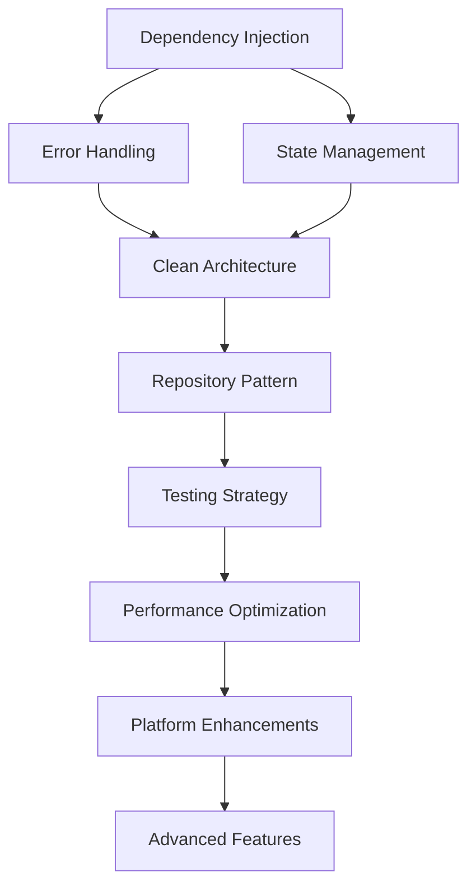

# MunichPulse Code Improvement Recommendations

## Table of Contents

1. [Executive Summary](#executive-summary)
2. [Architecture Improvements](#architecture-improvements)
3. [Code Quality Enhancements](#code-quality-enhancements)
4. [Data Layer Modernization](#data-layer-modernization)
5. [UI/UX Improvements](#uiux-improvements)
6. [Business Logic Refactoring](#business-logic-refactoring)
7. [Platform-Specific Enhancements](#platform-specific-enhancements)
8. [Modernization Opportunities](#modernization-opportunities)
9. [Implementation Roadmap](#implementation-roadmap)
10. [Risk Assessment](#risk-assessment)

---

## Executive Summary

### Overall Assessment

The MunichPulse application demonstrates a solid foundation with Kotlin Multiplatform and Compose Multiplatform technologies. The codebase follows a basic MVVM pattern with clear separation between UI, ViewModels, and data repositories. However, there are significant opportunities for improvement in architecture consistency, code quality, and modern development practices.

### Key Strengths

-   **Multiplatform Approach**: Effective use of KMP for shared code across Android, Web, and other platforms
-   **MVVM Pattern**: Basic implementation of MVVM with proper separation of concerns
-   **Compose Multiplatform**: Modern UI framework implementation with responsive design
-   **SQLDelight Integration**: Type-safe database access for local data persistence
-   **Firebase Integration**: Backend-as-a-Service implementation for authentication and data storage

### Critical Areas Needing Improvement

1. **Inconsistent Architecture**: Mixed patterns between singleton repositories and proper dependency injection
2. **State Management**: Fragmented state handling across ViewModels and repositories
3. **Error Handling**: Lack of centralized error handling strategy
4. **Testing**: Minimal test coverage across all layers
5. **Platform Parity**: Incomplete feature implementation across platforms
6. **Documentation**: Insufficient code documentation and architectural guidelines

### Priority Matrix

| Priority | Area                 | Impact | Effort | Timeline   |
| -------- | -------------------- | ------ | ------ | ---------- |
| High     | Dependency Injection | High   | Medium | 1-2 weeks  |
| High     | Error Handling       | High   | Medium | 1-2 weeks  |
| High     | State Management     | High   | High   | 2-3 weeks  |
| Medium   | Testing Strategy     | Medium | High   | 1-2 months |
| Medium   | Repository Pattern   | Medium | Medium | 2-3 weeks  |
| Low      | Documentation        | Medium | Low    | Ongoing    |

---

## Architecture Improvements

### 1. Standardizing MVVM Implementation

#### Current Issues

-   Inconsistent ViewModel patterns across different screens
-   Mixed use of singleton objects and proper dependency injection
-   Lack of clear boundaries between layers

#### Recommendations

**Implement Proper Dependency Injection**

```kotlin
// Create a DI module structure
interface AppModule {
    val eventRepository: EventRepository
    val userRepository: UserRepository
    val settingsRepository: SettingsRepository
    val firebaseService: FirebaseService
}

class ProductionAppModule : AppModule {
    override val eventRepository: EventRepository by lazy {
        EventRepositoryImpl(firebaseService)
    }

    override val userRepository: UserRepository by lazy {
        UserRepositoryImpl(firebaseService)
    }

    // ... other implementations
}
```

**Standardize ViewModel Factory Pattern**

```kotlin
abstract class BaseViewModel<T : UiState> : ViewModel() {
    private val _uiState = MutableStateFlow(initialState())
    val uiState: StateFlow<T> = _uiState.asStateFlow()

    protected abstract fun initialState(): T

    protected fun updateState(update: T.() -> T) {
        _uiState.update { it.update() }
    }
}

class LoginViewModel(
    private val authRepository: AuthRepository
) : BaseViewModel<LoginUiState>() {
    override fun initialState() = LoginUiState()

    fun login(email: String, password: String) {
        viewModelScope.launch {
            updateState { copy(isLoading = true) }
            try {
                val result = authRepository.login(email, password)
                updateState { copy(isLoading = false, user = result) }
            } catch (e: Exception) {
                updateState { copy(isLoading = false, error = e.message) }
            }
        }
    }
}
```

### 2. Dependency Injection Framework Implementation

#### Current Issues

-   Manual dependency management
-   Singleton objects acting as service locators
-   Difficult to test due to tight coupling

#### Recommendations

**Implement Koin or Kodein-DI**

```kotlin
// Using Koin for dependency injection
val appModule = module {
    single { FirebaseInterface.getInstance() }
    single<AuthRepository> { AuthRepositoryImpl(get()) }
    single<EventRepository> { EventRepositoryImpl(get()) }
    single<UserRepository> { UserRepositoryImpl(get()) }

    viewModel { LoginViewModel(get()) }
    viewModel { HomeViewModel(get()) }
    viewModel { MapViewModel(get()) }
    viewModel { GroupViewModel(get()) }
    viewModel { ProfileViewModel(get(), get()) }
}

// Application initialization
class MunichPulseApplication : Application() {
    override fun onCreate() {
        super.onCreate()
        startKoin {
            androidContext(this@MunichPulseApplication)
            modules(appModule)
        }
    }
}
```

### 3. Clean Architecture Layers

#### Current Issues

-   Business logic scattered across ViewModels and repositories
-   No clear domain layer
-   Data sources tightly coupled to repositories

#### Recommendations

**Implement Domain Layer**

```kotlin
// Domain entities
data class Event(
    val id: String,
    val title: String,
    val location: Location,
    val imageUrl: String,
    val fullnessPercentage: Int,
    val isTrending: Boolean = false,
    val attendees: List<Attendee> = emptyList()
)

// Use cases
interface GetEventsUseCase {
    suspend fun getTrendingEvents(): Result<List<Event>>
    suspend fun getNearbyEvents(location: Location): Result<List<Event>>
    suspend fun getAllEvents(): Result<List<Event>>
}

class GetEventsUseCaseImpl(
    private val eventRepository: EventRepository
) : GetEventsUseCase {
    override suspend fun getTrendingEvents(): Result<List<Event>> {
        return try {
            val events = eventRepository.getTrendingEvents()
            Result.success(events)
        } catch (e: Exception) {
            Result.failure(e)
        }
    }

    // ... other implementations
}
```

### 4. Module Organization Improvements

#### Current Issues

-   Flat package structure
-   Mixed concerns within modules
-   No clear module boundaries

#### Recommendations

**Reorganize into Feature Modules**

```
composeApp/
├── src/
│   ├── commonMain/kotlin/
│   │   ├── hackatum/munichpulse/
│   │   │   ├── domain/           // Domain layer
│   │   │   │   ├── model/
│   │   │   │   ├── repository/
│   │   │   │   └── usecase/
│   │   │   ├── data/             // Data layer
│   │   │   │   ├── local/
│   │   │   │   ├── remote/
│   │   │   │   └── repository/
│   │   │   ├── presentation/     // Presentation layer
│   │   │   │   ├── ui/
│   │   │   │   │   ├── home/
│   │   │   │   │   ├── map/
│   │   │   │   │   ├── groups/
│   │   │   │   │   └── profile/
│   │   │   │   ├── viewmodel/
│   │   │   │   └── navigation/
│   │   │   └── di/               // Dependency injection
│   │   └── platformMain/kotlin/  // Platform-specific
```

---

## Code Quality Enhancements

### 1. Code Consistency Improvements

#### Current Issues

-   Inconsistent naming conventions
-   Mixed code styles across files
-   Inconsistent use of Kotlin language features

#### Recommendations

**Establish Coding Standards**

```kotlin
// Consistent naming and structure
class EventRepositoryImpl @Inject constructor(
    private val remoteDataSource: EventRemoteDataSource,
    private val localDataSource: EventLocalDataSource
) : EventRepository {

    override fun getEvents(): Flow<List<Event>> = flow {
        emit(Resource.Loading())
        try {
            val events = remoteDataSource.getEvents()
            localDataSource.saveEvents(events)
            emit(Resource.Success(events))
        } catch (e: Exception) {
            val cachedEvents = localDataSource.getEvents()
            if (cachedEvents.isNotEmpty()) {
                emit(Resource.Success(cachedEvents))
            } else {
                emit(Resource.Error(e.message ?: "Unknown error"))
            }
        }
    }
}
```

**Implement Consistent Error Handling**

```kotlin
// Centralized error handling
sealed class Resource<out T> {
    data class Success<out T>(val data: T) : Resource<T>()
    data class Error(val message: String, val cause: Throwable? = null) : Resource<Nothing>()
    object Loading : Resource<Nothing>()
}

// Result wrapper for API calls
inline fun <T> safeCall(action: () -> T): Resource<T> {
    return try {
        Resource.Success(action())
    } catch (e: Exception) {
        Resource.Error(e.message ?: "Unknown error", e)
    }
}
```

### 2. Error Handling Standardization

#### Current Issues

-   Inconsistent error handling across ViewModels
-   No centralized error reporting
-   Poor user feedback for errors

#### Recommendations

**Implement Centralized Error Handler**

```kotlin
interface ErrorHandler {
    fun handleError(throwable: Throwable): ErrorState
    fun logError(throwable: Throwable, context: String)
}

class ErrorHandlerImpl @Inject constructor(
    private val logger: Logger
) : ErrorHandler {

    override fun handleError(throwable: Throwable): ErrorState {
        logError(throwable, "Unhandled error")

        return when (throwable) {
            is NetworkException -> ErrorState.NetworkError
            is AuthenticationException -> ErrorState.AuthenticationError
            is ValidationException -> ErrorState.ValidationError(throwable.message)
            else -> ErrorState.UnknownError
        }
    }

    override fun logError(throwable: Throwable, context: String) {
        logger.e(throwable, context)
        // Send to crash reporting service
    }
}
```

### 3. Documentation Improvements

#### Current Issues

-   Minimal KDoc comments
-   No architectural decision records
-   Missing API documentation

#### Recommendations

**Implement Comprehensive Documentation**

```kotlin
/**
 * Repository for managing event data operations.
 *
 * This repository provides a clean API for accessing event data from
 * both local and remote sources, implementing an offline-first approach
 * with caching capabilities.
 *
 * @property remoteDataSource Remote data source for API calls
 * @property localDataSource Local data source for database operations
 * @property cacheManager Cache management for optimized data access
 */
interface EventRepository {
    /**
     * Retrieves a flow of trending events.
     *
     * @return Flow emitting lists of trending events
     * @throws NetworkException when network connectivity issues occur
     * @throws DataException when data parsing fails
     */
    fun getTrendingEvents(): Flow<List<Event>>

    /**
     * Retrieves events near the specified location.
     *
     * @param location The center location for searching nearby events
     * @param radius Search radius in kilometers (default: 10km)
     * @return Flow emitting lists of nearby events
     */
    fun getNearbyEvents(location: Location, radius: Double = 10.0): Flow<List<Event>>
}
```

### 4. Testing Strategy Implementation

#### Current Issues

-   Minimal test coverage
-   No testing utilities or helpers
-   No integration tests

#### Recommendations

**Implement Comprehensive Testing Strategy**

```kotlin
// Unit tests for ViewModels
class LoginViewModelTest {
    @MockK
    private lateinit var authRepository: AuthRepository

    private lateinit var viewModel: LoginViewModel

    @Before
    fun setup() {
        MockKAnnotations.init(this)
        viewModel = LoginViewModel(authRepository)
    }

    @Test
    fun `login with valid credentials should succeed`() = runTest {
        // Given
        val email = "test@example.com"
        val password = "password123"
        coEvery { authRepository.login(email, password) } returns Result.success(mockUser)

        // When
        viewModel.login(email, password)

        // Then
        assertEquals(mockUser, viewModel.uiState.value.user)
        assertFalse(viewModel.uiState.value.isLoading)
        assertNull(viewModel.uiState.value.error)
    }

    @Test
    fun `login with invalid credentials should show error`() = runTest {
        // Given
        val email = "invalid@example.com"
        val password = "wrongpassword"
        coEvery { authRepository.login(email, password) } returns Result.failure(
            AuthenticationException("Invalid credentials")
        )

        // When
        viewModel.login(email, password)

        // Then
        assertNull(viewModel.uiState.value.user)
        assertFalse(viewModel.uiState.value.isLoading)
        assertEquals("Invalid credentials", viewModel.uiState.value.error)
    }
}

// Integration tests
class EventRepositoryIntegrationTest {
    private lateinit var database: SqlDriver
    private lateinit var repository: EventRepositoryImpl

    @Before
    fun setup() {
        database = InMemorySqlDriver()
        repository = EventRepositoryImpl(
            remoteDataSource = mockRemoteDataSource,
            localDataSource = LocalEventDataSource(database)
        )
    }

    @Test
    fun `get events should cache locally`() = runTest {
        // Given
        val events = listOf(mockEvent1, mockEvent2)
        coEvery { mockRemoteDataSource.getEvents() } returns events

        // When
        val result1 = repository.getEvents().first()
        val result2 = repository.getEvents().first()

        // Then
        assertEquals(events, result1)
        assertEquals(events, result2)
        coVerify(exactly = 1) { mockRemoteDataSource.getEvents() }
    }
}
```

---

## Data Layer Modernization

### 1. Repository Pattern Completion

#### Current Issues

-   Incomplete repository implementations
-   Missing repository interfaces
-   Direct access to data sources from ViewModels

#### Recommendations

**Implement Complete Repository Pattern**

```kotlin
// Repository interfaces
interface EventRepository {
    fun getAllEvents(): Flow<List<Event>>
    fun getTrendingEvents(): Flow<List<Event>>
    fun getNearbyEvents(location: Location): Flow<List<Event>>
    fun getEventById(eventId: String): Flow<Event?>
    suspend fun refreshEvents(): Result<Unit>
    suspend fun saveEvent(event: Event): Result<Unit>
    suspend fun deleteEvent(eventId: String): Result<Unit>
}

// Repository implementations
class EventRepositoryImpl @Inject constructor(
    private val remoteDataSource: EventRemoteDataSource,
    private val localDataSource: EventLocalDataSource,
    private val cacheManager: CacheManager
) : EventRepository {

    override fun getAllEvents(): Flow<List<Event>> = flow {
        emit(Resource.Loading())

        // First emit cached data if available
        val cachedEvents = localDataSource.getAllEvents()
        if (cachedEvents.isNotEmpty()) {
            emit(Resource.Success(cachedEvents))
        }

        // Then fetch fresh data
        try {
            val freshEvents = remoteDataSource.getAllEvents()
            localDataSource.saveEvents(freshEvents)
            cacheManager.put(CACHE_KEY_ALL_EVENTS, freshEvents)
            emit(Resource.Success(freshEvents))
        } catch (e: Exception) {
            if (cachedEvents.isNotEmpty()) {
                emit(Resource.Success(cachedEvents))
            } else {
                emit(Resource.Error(e.message ?: "Failed to fetch events"))
            }
        }
    }

    // ... other implementations
}
```

### 2. SQLDelight Integration

#### Current Issues

-   Incomplete SQLDelight implementation
-   Missing database migrations
-   No database versioning strategy

#### Recommendations

**Complete SQLDelight Implementation**

```kotlin
// Database schema with proper versioning
-- schema.sq (version 1)
CREATE TABLE Event (
    id TEXT NOT NULL PRIMARY KEY,
    title TEXT NOT NULL,
    description TEXT,
    location_name TEXT NOT NULL,
    location_latitude REAL NOT NULL,
    location_longitude REAL NOT NULL,
    image_url TEXT,
    fullness_percentage INTEGER NOT NULL DEFAULT 0,
    is_trending INTEGER AS kotlin.Boolean NOT NULL DEFAULT 0,
    start_date INTEGER,
    end_date INTEGER,
    created_at INTEGER NOT NULL,
    updated_at INTEGER NOT NULL
);

-- schema_2.sq (version 2)
ALTER TABLE Event ADD COLUMN category TEXT;
ALTER TABLE Event ADD COLUMN organizer_id TEXT;

-- Database implementation
class MunichPulseDatabase(
    driver: SqlDriver
) {
    val eventQueries: EventQueries = EventQueries(driver)
    val groupQueries: GroupQueries = GroupQueries(driver)
    val userQueries: UserQueries = UserQueries(driver)

    // Transaction helpers
    suspend fun <T> inTransaction(block: suspend () -> T): T {
        return withContext(Dispatchers.IO) {
            driver.transaction {
                runBlocking { block() }
            }
        }
    }
}

// Database migrations
val MIGRATION_1_2 = SqlDriver.Schema.migration(
    fromVersion = 1,
    toVersion = 2,
    // Migration SQL statements
    listOf(
        "ALTER TABLE Event ADD COLUMN category TEXT",
        "ALTER TABLE Event ADD COLUMN organizer_id TEXT"
    )
)
```

### 3. Caching Strategies

#### Current Issues

-   No systematic caching approach
-   Inconsistent cache invalidation
-   Missing offline support

#### Recommendations

**Implement Comprehensive Caching Strategy**

```kotlin
interface CacheManager {
    suspend fun <T> get(key: String): T?
    suspend fun <T> put(key: String, value: T, ttl: Duration? = null)
    suspend fun invalidate(key: String)
    suspend fun clear()
    suspend fun isExpired(key: String): Boolean
}

class CacheManagerImpl @Inject constructor(
    private val database: MunichPulseDatabase,
    private val memoryCache: LruCache<String, Any>
) : CacheManager {

    override suspend fun <T> get(key: String): T? {
        // First check memory cache
        @Suppress("UNCHECKED_CAST")
        memoryCache.get(key)?.let { return it as T }

        // Then check disk cache
        return try {
            val cachedItem = database.cacheQueries.selectByKey(key).executeAsOneOrNull()
            if (cachedItem != null && !isExpired(key)) {
                val deserialized = deserialize<T>(cachedItem.data)
                memoryCache.put(key, deserialized)
                deserialized
            } else {
                null
            }
        } catch (e: Exception) {
            null
        }
    }

    override suspend fun <T> put(key: String, value: T, ttl: Duration?) {
        // Update memory cache
        memoryCache.put(key, value)

        // Update disk cache
        val serialized = serialize(value)
        val expirationTime = ttl?.let { Clock.System.now().plus(it) }?.epochSeconds
        database.cacheQueries.insertOrReplace(
            key = key,
            data = serialized,
            expirationTime = expirationTime
        )
    }
}
```

### 4. Offline-First Architecture

#### Current Issues

-   Limited offline functionality
-   No conflict resolution strategy
-   Missing sync capabilities

#### Recommendations

**Implement Offline-First Architecture**

```kotlin
interface SyncManager {
    suspend fun syncEvents(): Result<Unit>
    suspend fun syncGroups(): Result<Unit>
    suspend fun syncUserData(): Result<Unit>
    fun getSyncStatus(): Flow<SyncStatus>
}

class SyncManagerImpl @Inject constructor(
    private val eventRepository: EventRepository,
    private val groupRepository: GroupRepository,
    private val userRepository: UserRepository,
    private val connectivityManager: ConnectivityManager
) : SyncManager {

    private val _syncStatus = MutableStateFlow(SyncStatus.Idle)
    override fun getSyncStatus(): Flow<SyncStatus> = _syncStatus.asStateFlow()

    override suspend fun syncEvents(): Result<Unit> {
        if (!connectivityManager.isConnected()) {
            return Result.failure(NetworkException("No internet connection"))
        }

        _syncStatus.value = SyncStatus.Syncing("Events")

        return try {
            // Fetch remote changes
            val remoteEvents = eventRemoteDataSource.getEvents()

            // Apply conflict resolution
            val resolvedEvents = resolveEventConflicts(remoteEvents)

            // Update local database
            eventRepository.saveEvents(resolvedEvents)

            // Push local changes to remote
            pushLocalEventChanges()

            _syncStatus.value = SyncStatus.Success
            Result.success(Unit)
        } catch (e: Exception) {
            _syncStatus.value = SyncStatus.Error(e.message ?: "Sync failed")
            Result.failure(e)
        }
    }

    private suspend fun resolveEventConflicts(
        remoteEvents: List<Event>
    ): List<Event> {
        val localEvents = eventRepository.getAllEvents().first()

        return remoteEvents.map { remoteEvent ->
            val localEvent = localEvents.find { it.id == remoteEvent.id }

            when {
                localEvent == null -> remoteEvent
                localEvent.updatedAt > remoteEvent.updatedAt -> localEvent
                else -> remoteEvent
            }
        }
    }
}
```

---

## UI/UX Improvements

### 1. Component Extraction and Reusability

#### Current Issues

-   Duplicated UI code across screens
-   No design system implementation
-   Inconsistent component usage

#### Recommendations

**Implement Design System with Reusable Components**

```kotlin
// Design system components
@Composable
fun MunichPulseButton(
    text: String,
    onClick: () -> Unit,
    modifier: Modifier = Modifier,
    enabled: Boolean = true,
    loading: Boolean = false,
    variant: ButtonVariant = ButtonVariant.Primary
) {
    Button(
        onClick = onClick,
        modifier = modifier,
        enabled = enabled && !loading,
        colors = when (variant) {
            ButtonVariant.Primary -> ButtonDefaults.buttonColors(
                containerColor = MaterialTheme.colorScheme.primary,
                contentColor = MaterialTheme.colorScheme.onPrimary
            )
            ButtonVariant.Secondary -> ButtonDefaults.buttonColors(
                containerColor = MaterialTheme.colorScheme.secondary,
                contentColor = MaterialTheme.colorScheme.onSecondary
            )
            ButtonVariant.Outline -> ButtonDefaults.outlinedButtonColors(
                contentColor = MaterialTheme.colorScheme.primary
            )
        }
    ) {
        if (loading) {
            CircularProgressIndicator(
                modifier = Modifier.size(16.dp),
                strokeWidth = 2.dp,
                color = MaterialTheme.colorScheme.onPrimary
            )
        } else {
            Text(text)
        }
    }
}

@Composable
fun EventCard(
    event: Event,
    onEventClick: (String) -> Unit,
    modifier: Modifier = Modifier
) {
    Card(
        modifier = modifier
            .fillMaxWidth()
            .clickable { onEventClick(event.id) },
        elevation = CardDefaults.cardElevation(defaultElevation = 4.dp)
    ) {
        Column {
            AsyncImage(
                model = event.imageUrl,
                contentDescription = event.title,
                modifier = Modifier
                    .fillMaxWidth()
                    .height(200.dp),
                contentScale = ContentScale.Crop
            )

            Column(modifier = Modifier.padding(16.dp)) {
                Text(
                    text = event.title,
                    style = MaterialTheme.typography.titleMedium,
                    maxLines = 1,
                    overflow = TextOverflow.Ellipsis
                )

                Spacer(modifier = Modifier.height(4.dp))

                Text(
                    text = event.location,
                    style = MaterialTheme.typography.bodyMedium,
                    color = MaterialTheme.colorScheme.onSurfaceVariant
                )

                Spacer(modifier = Modifier.height(8.dp))

                Row(
                    modifier = Modifier.fillMaxWidth(),
                    horizontalArrangement = Arrangement.SpaceBetween,
                    verticalAlignment = Alignment.CenterVertically
                ) {
                    FullnessIndicator(
                        percentage = event.fullnessPercentage,
                        modifier = Modifier.weight(1f)
                    )

                    if (event.isTrending) {
                        TrendingBadge()
                    }
                }
            }
        }
    }
}
```

### 2. Accessibility Enhancements

#### Current Issues

-   Missing content descriptions
-   No support for screen readers
-   Inadequate touch target sizes

#### Recommendations

**Implement Comprehensive Accessibility Support**

```kotlin
@Composable
fun AccessibleEventCard(
    event: Event,
    onEventClick: (String) -> Unit,
    modifier: Modifier = Modifier
) {
    Card(
        modifier = modifier
            .fillMaxWidth()
            .semantics {
                this.contentDescription = "${event.title} at ${event.location}"
                this.onClick { onEventClick(event.id); true }
                this.role = Role.Button
            }
            .minimumInteractiveSize(48.dp), // Minimum touch target
        elevation = CardDefaults.cardElevation(defaultElevation = 4.dp)
    ) {
        Column {
            AsyncImage(
                model = event.imageUrl,
                contentDescription = "Image of ${event.title}",
                modifier = Modifier
                    .fillMaxWidth()
                    .height(200.dp),
                contentScale = ContentScale.Crop
            )

            Column(modifier = Modifier.padding(16.dp)) {
                Text(
                    text = event.title,
                    style = MaterialTheme.typography.titleMedium,
                    maxLines = 1,
                    overflow = TextOverflow.Ellipsis
                )

                Row(
                    verticalAlignment = Alignment.CenterVertically
                ) {
                    Icon(
                        imageVector = Icons.Default.LocationOn,
                        contentDescription = null, // Decorative icon
                        modifier = Modifier.size(16.dp)
                    )

                    Spacer(modifier = Modifier.width(4.dp))

                    Text(
                        text = event.location,
                        style = MaterialTheme.typography.bodyMedium,
                        color = MaterialTheme.colorScheme.onSurfaceVariant
                    )
                }

                Spacer(modifier = Modifier.height(8.dp))

                FullnessIndicator(
                    percentage = event.fullnessPercentage,
                    modifier = Modifier.semantics {
                        this.contentDescription = "Event is ${event.fullnessPercentage}% full"
                    }
                )
            }
        }
    }
}

// Custom accessibility service for announcements
class AccessibilityManager @Inject constructor(
    private val context: Context
) {
    fun announceForAccessibility(message: String) {
        val event = AccessibilityEvent.obtain().apply {
            eventType = AccessibilityEvent.TYPE_ANNOUNCEMENT
            text.add(message)
        }

        val manager = context.getSystemService(Context.ACCESSIBILITY_SERVICE)
            as AccessibilityManager
        manager.sendAccessibilityEvent(event)
    }
}
```

### 3. Performance Optimizations

#### Current Issues

-   Inefficient recomposition
-   Memory leaks in image loading
-   No lazy loading for large lists

#### Recommendations

**Implement Performance Optimizations**

```kotlin
// Optimized list with lazy loading
@Composable
fun OptimizedEventList(
    events: List<Event>,
    onEventClick: (String) -> Unit,
    modifier: Modifier = Modifier
) {
    LazyColumn(
        modifier = modifier.fillMaxSize(),
        contentPadding = PaddingValues(16.dp),
        verticalArrangement = Arrangement.spacedBy(16.dp)
    ) {
        items(
            items = events,
            key = { it.id } // Stable key for efficient recomposition
        ) { event ->
            // Remember derived state to prevent unnecessary recomposition
            val formattedFullness = remember(event.fullnessPercentage) {
                "${event.fullnessPercentage}% full"
            }

            EventCard(
                event = event,
                onEventClick = onEventClick,
                modifier = Modifier.animateItemPlacement()
            )
        }
    }
}

// Optimized image loading with caching
@Composable
fun OptimizedAsyncImage(
    url: String,
    contentDescription: String?,
    modifier: Modifier = Modifier,
    placeholder: Painter? = null
) {
    AsyncImage(
        model = ImageRequest.Builder(LocalContext.current)
            .data(url)
            .memoryCachePolicy(CachePolicy.ENABLED)
            .diskCachePolicy(CachePolicy.ENABLED)
            .networkCachePolicy(CachePolicy.ENABLED)
            .crossfade(true)
            .build(),
        contentDescription = contentDescription,
        modifier = modifier,
        placeholder = placeholder,
        error = placeholder,
        contentScale = ContentScale.Crop,
        loading = {
            Box(
                modifier = Modifier.fillMaxSize(),
                contentAlignment = Alignment.Center
            ) {
                CircularProgressIndicator()
            }
        }
    )
}

// State hoisting for better performance
@Composable
fun OptimizedHomeScreen(
    viewModel: HomeViewModel = viewModel(),
    onEventClick: (String) -> Unit
) {
    // Collect state once and remember to prevent recomposition
    val uiState by viewModel.uiState.collectAsState()

    // Derive UI state from main state
    val trendingEvents = remember(uiState.events) {
        uiState.events.filter { it.isTrending }
    }

    val nearbyEvents = remember(uiState.events, uiState.userLocation) {
        if (uiState.userLocation != null) {
            uiState.events.sortedBy { event ->
                calculateDistance(event.location, uiState.userLocation!!)
            }.take(5)
        } else {
            emptyList()
        }
    }

    when (uiState.isLoading) {
        true -> LoadingScreen()
        false -> {
            if (uiState.error != null) {
                ErrorScreen(
                    error = uiState.error,
                    onRetry = { viewModel.refreshEvents() }
                )
            } else {
                HomeContent(
                    trendingEvents = trendingEvents,
                    nearbyEvents = nearbyEvents,
                    onEventClick = onEventClick
                )
            }
        }
    }
}
```

### 4. User Experience Patterns

#### Current Issues

-   No loading states
-   Poor error feedback
-   Missing offline indicators

#### Recommendations

**Implement Comprehensive UX Patterns**

```kotlin
@Composable
fun LoadingState(
    message: String = "Loading...",
    modifier: Modifier = Modifier
) {
    Box(
        modifier = modifier.fillMaxSize(),
        contentAlignment = Alignment.Center
    ) {
        Column(
            horizontalAlignment = Alignment.CenterHorizontally
        ) {
            CircularProgressIndicator(
                color = MaterialTheme.colorScheme.primary
            )

            Spacer(modifier = Modifier.height(16.dp))

            Text(
                text = message,
                style = MaterialTheme.typography.bodyMedium,
                color = MaterialTheme.colorScheme.onSurfaceVariant
            )
        }
    }
}

@Composable
fun ErrorState(
    error: String,
    onRetry: (() -> Unit)? = null,
    modifier: Modifier = Modifier
) {
    Box(
        modifier = modifier.fillMaxSize(),
        contentAlignment = Alignment.Center
    ) {
        Column(
            horizontalAlignment = Alignment.CenterHorizontally,
            modifier = Modifier.padding(16.dp)
        ) {
            Icon(
                imageVector = Icons.Default.Error,
                contentDescription = null,
                tint = MaterialTheme.colorScheme.error,
                modifier = Modifier.size(48.dp)
            )

            Spacer(modifier = Modifier.height(16.dp))

            Text(
                text = error,
                style = MaterialTheme.typography.bodyLarge,
                color = MaterialTheme.colorScheme.onSurface,
                textAlign = TextAlign.Center
            )

            if (onRetry != null) {
                Spacer(modifier = Modifier.height(16.dp))

                MunichPulseButton(
                    text = "Retry",
                    onClick = onRetry,
                    variant = ButtonVariant.Outline
                )
            }
        }
    }
}

@Composable
fun OfflineIndicator(
    isVisible: Boolean,
    modifier: Modifier = Modifier
) {
    AnimatedVisibility(
        visible = isVisible,
        enter = slideInVertically() + fadeIn(),
        exit = slideOutVertically() + fadeOut()
    ) {
        Surface(
            modifier = modifier.fillMaxWidth(),
            color = MaterialTheme.colorScheme.errorContainer,
            contentColor = MaterialTheme.colorScheme.onErrorContainer
        ) {
            Row(
                modifier = Modifier
                    .fillMaxWidth()
                    .padding(16.dp),
                horizontalArrangement = Arrangement.Center,
                verticalAlignment = Alignment.CenterVertically
            ) {
                Icon(
                    imageVector = Icons.Default.CloudOff,
                    contentDescription = null,
                    modifier = Modifier.size(16.dp)
                )

                Spacer(modifier = Modifier.width(8.dp))

                Text(
                    text = "You're offline. Some features may be unavailable.",
                    style = MaterialTheme.typography.bodySmall
                )
            }
        }
    }
}
```

---

## Business Logic Refactoring

### 1. Centralization of Business Rules

#### Current Issues

-   Business logic scattered across ViewModels
-   No clear separation of concerns
-   Duplicated business rules

#### Recommendations

**Implement Centralized Business Logic**

```kotlin
// Domain layer for business rules
interface EventBusinessRules {
    fun canUserJoinEvent(user: User, event: Event): Boolean
    fun calculateEventFullness(event: Event): Int
    fun isEventTrending(event: Event): Boolean
    fun validateEventCreation(event: Event): ValidationResult
}

class EventBusinessRulesImpl @Inject constructor(
    private val userRepository: UserRepository,
    private val groupRepository: GroupRepository
) : EventBusinessRules {

    override fun canUserJoinEvent(user: User, event: Event): Boolean {
        // Business rule: User must be authenticated
        if (user.id.isEmpty()) return false

        // Business rule: Event must not be full
        if (event.fullnessPercentage >= 100) return false

        // Business rule: User must not already be in a group for this event
        val userGroups = groupRepository.getUserGroups(user.id)
        if (userGroups.any { it.eventId == event.id }) return false

        // Business rule: Check user's location proximity (if applicable)
        if (user.location != null && event.location != null) {
            val distance = calculateDistance(user.location!!, event.location!!)
            if (distance > MAX_DISTANCE_TO_JOIN) return false
        }

        return true
    }

    override fun calculateEventFullness(event: Event): Int {
        // Business logic for calculating fullness based on various factors
        val baseFullness = event.fullnessPercentage

        // Apply business rules
        return when {
            baseFullness >= 95 -> 100 // Cap at 100%
            baseFullness < 0 -> 0     // Minimum 0%
            else -> baseFullness
        }
    }

    override fun isEventTrending(event: Event): Boolean {
        // Complex business logic for determining if an event is trending
        val now = Clock.System.now().epochSeconds
        val eventStart = event.startDate ?: return false

        // Business rule: Events within 7 days and with high attendance are trending
        val isUpcoming = (eventStart - now) <= TimeUnit.DAYS.toSeconds(7)
        val hasHighAttendance = event.fullnessPercentage >= 70

        return isUpcoming && hasHighAttendance
    }

    override fun validateEventCreation(event: Event): ValidationResult {
        val errors = mutableListOf<String>()

        if (event.title.isBlank()) {
            errors.add("Event title cannot be empty")
        }

        if (event.location.isBlank()) {
            errors.add("Event location cannot be empty")
        }

        if (event.startDate != null && event.endDate != null) {
            if (event.startDate >= event.endDate) {
                errors.add("Start date must be before end date")
            }
        }

        return if (errors.isEmpty()) {
            ValidationResult.Success
        } else {
            ValidationResult.Error(errors)
        }
    }
}

// Use cases that implement business logic
class JoinEventUseCase @Inject constructor(
    private val eventRepository: EventRepository,
    private val groupRepository: GroupRepository,
    private val businessRules: EventBusinessRules
) {
    suspend operator fun invoke(
        userId: String,
        eventId: String
    ): Result<Unit> {
        return try {
            val user = userRepository.getUser(userId)
                ?: return Result.failure(UserNotFoundException("User not found"))

            val event = eventRepository.getEventById(eventId)
                ?: return Result.failure(EventNotFoundException("Event not found"))

            if (!businessRules.canUserJoinEvent(user, event)) {
                return Result.failure(BusinessRuleException("User cannot join this event"))
            }

            groupRepository.joinEvent(userId, eventId)
            Result.success(Unit)
        } catch (e: Exception) {
            Result.failure(e)
        }
    }
}
```

### 2. Use Case Implementation

#### Current Issues

-   No clear use case layer
-   Business logic mixed with UI logic
-   No clear transaction boundaries

#### Recommendations

**Implement Comprehensive Use Case Layer**

```kotlin
// Base use case interface
abstract class UseCase<in P, R> {
    abstract suspend operator fun invoke(parameters: P): Result<R>
}

// Specific use cases
class GetEventsUseCase @Inject constructor(
    private val eventRepository: EventRepository,
    private val businessRules: EventBusinessRules
) : UseCase<GetEventsParameters, List<Event>>() {

    override suspend fun invoke(parameters: GetEventsParameters): Result<List<Event>> {
        return try {
            val events = when (parameters.filter) {
                EventFilter.ALL -> eventRepository.getAllEvents().first()
                EventFilter.TRENDING -> eventRepository.getTrendingEvents().first()
                EventFilter.NEARBY -> {
                    if (parameters.location == null) {
                        return Result.failure(InvalidParametersException("Location required for nearby events"))
                    }
                    eventRepository.getNearbyEvents(parameters.location).first()
                }
            }

            // Apply business rules
            val processedEvents = events.map { event ->
                event.copy(
                    isTrending = businessRules.isEventTrending(event),
                    fullnessPercentage = businessRules.calculateEventFullness(event)
                )
            }

            Result.success(processedEvents)
        } catch (e: Exception) {
            Result.failure(e)
        }
    }
}

class CreateEventUseCase @Inject constructor(
    private val eventRepository: EventRepository,
    private val businessRules: EventBusinessRules,
    private val validationService: ValidationService
) : UseCase<CreateEventParameters, Event>() {

    override suspend fun invoke(parameters: CreateEventParameters): Result<Event> {
        return try {
            // Validate input
            val validationResult = validationService.validateEvent(parameters)
            if (validationResult is ValidationResult.Error) {
                return Result.failure(ValidationException(validationResult.errors))
            }

            // Create event object
            val event = Event(
                id = UUID.randomUUID().toString(),
                title = parameters.title,
                location = parameters.location,
                imageUrl = parameters.imageUrl,
                fullnessPercentage = 0,
                isTrending = false,
                startDate = parameters.startDate,
                endDate = parameters.endDate,
                createdAt = Clock.System.now().epochSeconds,
                updatedAt = Clock.System.now().epochSeconds
            )

            // Apply business rules
            val businessRuleResult = businessRules.validateEventCreation(event)
            if (businessRuleResult is ValidationResult.Error) {
                return Result.failure(BusinessRuleException(businessRuleResult.errors))
            }

            // Save event
            eventRepository.saveEvent(event)
            Result.success(event)
        } catch (e: Exception) {
            Result.failure(e)
        }
    }
}

// Use case parameters
data class GetEventsParameters(
    val filter: EventFilter,
    val location: Location? = null
)

data class CreateEventParameters(
    val title: String,
    val location: String,
    val imageUrl: String?,
    val startDate: Long?,
    val endDate: Long?
)

enum class EventFilter {
    ALL, TRENDING, NEARBY
}
```

### 3. State Management Improvements

#### Current Issues

-   Inconsistent state management patterns
-   No centralized state store
-   State scattered across ViewModels

#### Recommendations

**Implement Centralized State Management**

```kotlin
// Centralized state management
interface AppState {
    val userState: StateFlow<UserState>
    val eventState: StateFlow<EventState>
    val groupState: StateFlow<GroupState>
    val uiState: StateFlow<UiState>

    fun updateUserState(update: UserState.() -> UserState)
    fun updateEventState(update: EventState.() -> EventState)
    fun updateGroupState(update: GroupState.() -> GroupState)
    fun updateUiState(update: UiState.() -> UiState)
}

class AppStateImpl @Inject constructor(
    private val userRepository: UserRepository,
    private val eventRepository: EventRepository,
    private val groupRepository: GroupRepository
) : AppState {

    private val _userState = MutableStateFlow(UserState())
    override val userState: StateFlow<UserState> = _userState.asStateFlow()

    private val _eventState = MutableStateFlow(EventState())
    override val eventState: StateFlow<EventState> = _eventState.asStateFlow()

    private val _groupState = MutableStateFlow(GroupState())
    override val groupState: StateFlow<GroupState> = _groupState.asStateFlow()

    private val _uiState = MutableStateFlow(UiState())
    override val uiState: StateFlow<UiState> = _uiState.asStateFlow()

    init {
        initializeState()
    }

    private fun initializeState() {
        // Initialize user state
        viewModelScope.launch {
            userRepository.getCurrentUser().collect { user ->
                updateUserState { copy(currentUser = user) }
            }
        }

        // Initialize event state
        viewModelScope.launch {
            eventRepository.getAllEvents().collect { events ->
                updateEventState { copy(events = events) }
            }
        }

        // Initialize group state
        viewModelScope.launch {
            groupRepository.getUserGroups().collect { groups ->
                updateGroupState { copy(groups = groups) }
            }
        }
    }

    override fun updateUserState(update: UserState.() -> UserState) {
        _userState.update { it.update() }
    }

    override fun updateEventState(update: EventState.() -> EventState) {
        _eventState.update { it.update() }
    }

    override fun updateGroupState(update: GroupState.() -> GroupState) {
        _groupState.update { it.update() }
    }

    override fun updateUiState(update: UiState.() -> UiState) {
        _uiState.update { it.update() }
    }
}

// State classes
data class UserState(
    val currentUser: User? = null,
    val isLoading: Boolean = false,
    val error: String? = null
)

data class EventState(
    val events: List<Event> = emptyList(),
    val selectedEvent: Event? = null,
    val isLoading: Boolean = false,
    val error: String? = null
)

data class GroupState(
    val groups: List<Group> = emptyList(),
    val selectedGroup: Group? = null,
    val isLoading: Boolean = false,
    val error: String? = null
)

data class UiState(
    val isDarkMode: Boolean = false,
    val isOffline: Boolean = false,
    val currentScreen: String = "home"
)
```

### 4. Cross-Cutting Concerns

#### Current Issues

-   No centralized logging
-   Missing analytics tracking
-   No performance monitoring

#### Recommendations

**Implement Cross-Cutting Concerns**

```kotlin
// Centralized logging
interface Logger {
    fun d(tag: String, message: String)
    fun i(tag: String, message: String)
    fun w(tag: String, message: String, throwable: Throwable? = null)
    fun e(tag: String, message: String, throwable: Throwable? = null)
    fun logUserAction(action: String, properties: Map<String, Any> = emptyMap())
}

class LoggerImpl @Inject constructor(
    private val crashlytics: Crashlytics,
    private val analytics: Analytics
) : Logger {

    override fun d(tag: String, message: String) {
        if (BuildConfig.DEBUG) {
            Log.d(tag, message)
        }
    }

    override fun i(tag: String, message: String) {
        Log.i(tag, message)
    }

    override fun w(tag: String, message: String, throwable: Throwable?) {
        Log.w(tag, message, throwable)
        crashlytics.recordException(throwable ?: Exception(message))
    }

    override fun e(tag: String, message: String, throwable: Throwable?) {
        Log.e(tag, message, throwable)
        crashlytics.recordException(throwable ?: Exception(message))
    }

    override fun logUserAction(action: String, properties: Map<String, Any>) {
        analytics.logEvent(action, properties)
    }
}

// Performance monitoring
interface PerformanceMonitor {
    fun startTrace(name: String): PerformanceTrace
    fun recordMetric(name: String, value: Long)
    fun recordScreenView(screenName: String)
}

class PerformanceMonitorImpl @Inject constructor(
    private val firebasePerformance: FirebasePerformance
) : PerformanceMonitor {

    override fun startTrace(name: String): PerformanceTrace {
        return firebasePerformance.newTrace(name).apply {
            start()
        }
    }

    override fun recordMetric(name: String, value: Long) {
        firebasePerformance.newTrace("custom_metric").apply {
            putMetric(name, value)
            stop()
        }
    }

    override fun recordScreenView(screenName: String) {
        firebasePerformance.newTrace("screen_view_$screenName").apply {
            start()
            stop()
        }
    }
}

// Decorator pattern for adding cross-cutting concerns
class RepositoryDecorator<T>(
    private val repository: T,
    private val logger: Logger,
    private val performanceMonitor: PerformanceMonitor
) {

    inline fun <R> withMonitoring(
        operationName: String,
        crossinline operation: suspend () -> R
    ): R {
        val trace = performanceMonitor.startTrace(operationName)

        return try {
            logger.d("Repository", "Starting $operationName")
            val result = runBlocking { operation() }
            logger.d("Repository", "Completed $operationName")
            result
        } catch (e: Exception) {
            logger.e("Repository", "Error in $operationName", e)
            throw e
        } finally {
            trace.stop()
        }
    }
}
```

---

## Platform-Specific Enhancements

### 1. Web Platform Completion

#### Current Issues

-   Incomplete web implementation
-   Missing responsive design
-   No PWA features

#### Recommendations

**Complete Web Platform Implementation**

```kotlin
// Web-specific implementations
@JsName("WebMapComponent")
actual class MapComponent actual constructor(
    private val context: Any
) {
    private var mapboxMap: MapboxMap? = null
    private val markers = mutableMapOf<String, Marker>()

    actual fun initialize(
        containerId: String,
        initialCenter: Location,
        initialZoom: Double
    ) {
        mapboxgl.accessToken = Secrets.MAPBOX_PUBLIC_TOKEN

        mapboxMap = mapboxgl.Map(
            jsObject {
                container = containerId
                style = "mapbox://styles/mapbox/streets-v11"
                center = arrayOf(initialCenter.longitude, initialCenter.latitude)
                zoom = initialZoom
            }
        )

        setupMapControls()
    }

    actual fun addMarker(marker: MapMarker) {
        val map = mapboxMap ?: return

        val mapboxMarker = mapboxgl.Marker(jsObject {
            element = createMarkerElement(marker)
        }).setLngLat(arrayOf(marker.location.longitude, marker.location.latitude))

        mapboxMarker.addTo(map)
        markers[marker.id] = marker
    }

    actual fun removeMarker(markerId: String) {
        markers.remove(markerId)?.let {
            // Remove from map
        }
    }

    actual fun centerOnLocation(location: Location, zoom: Double) {
        mapboxMap?.flyTo(jsObject {
            center = arrayOf(location.longitude, location.latitude)
            zoom = zoom
        })
    }

    private fun setupMapControls() {
        mapboxMap?.addControl(
            mapboxgl.NavigationControl(),
            "top-right"
        )

        mapboxMap?.addControl(
            mapboxgl.GeolocateControl(jsObject {
                positionOptions = jsObject {
                    enableHighAccuracy = true
                }
                trackUserLocation = true
            }),
            "top-left"
        )
    }

    private fun createMarkerElement(marker: MapMarker): HTMLElement {
        val element = document.createElement("div")
        element.className = "map-marker"
        element.innerHTML = """
            <div class="marker-content">
                
                <span class="marker-title">${marker.title}</span>
            </div>
        """.trimIndent()

        element.addEventListener("click") {
            marker.onClick()
        }

        return element
    }
}

// Responsive design utilities
@Composable
fun ResponsiveLayout(
    content: @Composable (WindowSizeClass) -> Unit
) {
    val configuration = LocalConfiguration.current
    val screenWidth = configuration.screenWidthDp.dp

    val windowSizeClass = when {
        screenWidth < 600.dp -> WindowSizeClass.Compact
        screenWidth < 840.dp -> WindowSizeClass.Medium
        else -> WindowSizeClass.Expanded
    }

    content(windowSizeClass)
}

// PWA features
@Composable
fun PWAInstaller() {
    var deferredPrompt by remember { mutableStateOf<BeforeInstallPromptEvent?>(null) }
    var isInstalled by remember { mutableStateOf(false) }

    LaunchedEffect(Unit) {
        // Check if already installed
        isInstalled = (window.matchMedia("(display-mode: standalone)").matches)

        // Listen for beforeinstallprompt event
        window.addEventListener("beforeinstallprompt") { event ->
            deferredPrompt = event as BeforeInstallPromptEvent
        }
    }

    if (deferredPrompt != null && !isInstalled) {
        MunichPulseButton(
            text = "Install App",
            onClick = {
                deferredPrompt?.prompt()
                deferredPrompt?.userChoice?.then { result ->
                    if (result.outcome == "accepted") {
                        isInstalled = true
                    }
                    deferredPrompt = null
                }
            }
        )
    }
}
```

### 2. Platform Parity Improvements

#### Current Issues

-   Feature gaps between platforms
-   Inconsistent UI behavior
-   Platform-specific bugs

#### Recommendations

**Ensure Platform Parity**

```kotlin
// Platform interface for consistent behavior
expect class PlatformUtils() {
    fun shareText(text: String, title: String? = null)
    fun openUrl(url: String)
    fun getDeviceInfo(): DeviceInfo
    fun requestNotificationPermission(): Boolean
    fun showNotification(title: String, message: String)
}

// Android implementation
actual class PlatformUtils actual constructor(
    private val context: Context
) {
    actual fun shareText(text: String, title: String?) {
        val sendIntent = Intent().apply {
            action = Intent.ACTION_SEND
            putExtra(Intent.EXTRA_TEXT, text)
            type = "text/plain"
            title?.let { putExtra(Intent.EXTRA_TITLE, it) }
        }

        val shareIntent = Intent.createChooser(sendIntent, null)
        context.startActivity(shareIntent)
    }

    actual fun openUrl(url: String) {
        val intent = Intent(Intent.ACTION_VIEW, Uri.parse(url))
        context.startActivity(intent)
    }

    actual fun getDeviceInfo(): DeviceInfo {
        return DeviceInfo(
            platform = "Android",
            version = Build.VERSION.RELEASE,
            model = Build.MODEL,
            appVersion = BuildConfig.VERSION_NAME
        )
    }

    actual fun requestNotificationPermission(): Boolean {
        return if (Build.VERSION.SDK_INT >= Build.VERSION_CODES.TIRAMISU) {
            // Android 13+ notification permission
            // Implementation here
            true
        } else {
            true
        }
    }

    actual fun showNotification(title: String, message: String) {
        // Android notification implementation
    }
}

// Web implementation
actual class PlatformUtils actual constructor() {
    actual fun shareText(text: String, title: String?) {
        if (navigator.share != undefined) {
            navigator.share(jsObject {
                this.title = title
                this.text = text
            })
        } else {
            // Fallback: copy to clipboard
            document.execCommand("copy")
        }
    }

    actual fun openUrl(url: String) {
        window.open(url, "_blank")
    }

    actual fun getDeviceInfo(): DeviceInfo {
        return DeviceInfo(
            platform = "Web",
            version = navigator.userAgent.substringAfter("Chrome/").substringBefore(" "),
            model = navigator.platform,
            appVersion = "1.0.0"
        )
    }

    actual fun requestNotificationPermission(): Boolean {
        return Notification.requestPermission() == "granted"
    }

    actual fun showNotification(title: String, message: String) {
        Notification(title, jsObject {
            body = message
            icon = "/icon.png"
        })
    }
}
```

### 3. Performance Optimizations

#### Current Issues

-   Slow app startup
-   Memory leaks
-   Inefficient rendering

#### Recommendations

**Implement Performance Optimizations**

```kotlin
// Android-specific optimizations
class AndroidPerformanceOptimizer @Inject constructor(
    private val context: Context
) {

    fun optimizeAppStartup() {
        // Enable startup optimizations
        if (Build.VERSION.SDK_INT >= Build.VERSION_CODES.S) {
            SplashScreen.installSplashScreen(context as Activity)
        }

        // Optimize memory usage
        val memoryInfo = ActivityManager.MemoryInfo()
        val activityManager = context.getSystemService(Context.ACTIVITY_SERVICE) as ActivityManager
        activityManager.getMemoryInfo(memoryInfo)

        if (memoryInfo.lowMemory) {
            // Reduce memory usage
            System.gc()
        }
    }

    fun optimizeImageLoading() {
        // Configure image loading for Android
        Coil.setImageLoader(
            ImageLoader.Builder(context)
                .memoryCache {
                    MemoryCache.Builder(context)
                        .maxSizePercent(0.25)
                        .build()
                }
                .diskCache {
                    DiskCache.Builder()
                        .directory(context.cacheDir.resolve("image_cache"))
                        .maxSizeBytes(50L * 1024 * 1024) // 50MB
                        .build()
                }
                .respectCacheHeaders(false)
                .build()
        )
    }
}

// Web-specific optimizations
class WebPerformanceOptimizer {

    fun optimizeWebApp() {
        // Enable service worker for caching
        if (js("navigator.serviceWorker" in window)) {
            js("navigator.serviceWorker.register('/sw.js')")
        }

        // Optimize bundle loading
        js("""
            if ('requestIdleCallback' in window) {
                requestIdleCallback(() => {
                    // Load non-critical resources
                });
            }
        """)

        // Enable virtual scrolling for large lists
        enableVirtualScrolling()
    }

    private fun enableVirtualScrolling() {
        // Implementation for virtual scrolling
    }
}
```

### 4. Build Configuration Improvements

#### Current Issues

-   Inconsistent build configurations
-   Missing optimization flags
-   No environment-specific configurations

#### Recommendations

**Improve Build Configurations**

```kotlin
// build.gradle.kts improvements
android {
    buildTypes {
        debug {
            isDebuggable = true
            applicationIdSuffix = ".debug"
            versionNameSuffix = "-debug"

            // Enable debugging tools
            buildConfigField("boolean", "ENABLE_CRASHLYTICS", "false")
            buildConfigField("boolean", "ENABLE_ANALYTICS", "false")
        }

        release {
            isMinifyEnabled = true
            isShrinkResources = true
            proguardFiles(
                getDefaultProguardFile("proguard-android-optimize.txt"),
                "proguard-rules.pro"
            )

            // Optimize for release
            buildConfigField("boolean", "ENABLE_CRASHLYTICS", "true")
            buildConfigField("boolean", "ENABLE_ANALYTICS", "true")
        }

        create("staging") {
            initWith(getByName("debug"))
            applicationIdSuffix = ".staging"
            versionNameSuffix = "-staging"

            buildConfigField("boolean", "ENABLE_CRASHLYTICS", "true")
            buildConfigField("boolean", "ENABLE_ANALYTICS", "false")
        }
    }

    // Enable R8 full mode for better optimization
    buildFeatures {
        buildConfig = true
        compose = true
    }

    compileOptions {
        isCoreLibraryDesugaringEnabled = true
    }
}

// Web build optimizations
val jsBrowserProductionWebpackConfig = tasks.named<org.jetbrains.kotlin.gradle.targets.js.webpack.KotlinWebpackConfig>("jsBrowserProductionWebpack") {
    // Enable code splitting
    commonWebpackConfig {
        cssSupport {
            enabled.set(true)
        }
    }

    // Optimize bundle size
    config {
        optimization.splitChunks = true
    }
}
```

---

## Modernization Opportunities

### 1. Kotlin Language Features

#### Current Issues

-   Not using latest Kotlin features
-   Outdated coding patterns
-   Missing language optimizations

#### Recommendations

**Implement Modern Kotlin Features**

```kotlin
// Use context receivers for better dependency injection
context(Logger, PerformanceMonitor)
class EventRepositoryImpl(
    private val remoteDataSource: EventRemoteDataSource,
    private val localDataSource: EventLocalDataSource
) : EventRepository {

    override fun getEvents(): Flow<List<Event>> = flow {
        val trace = startTrace("get_events")
        try {
            d("EventRepository", "Fetching events")

            emit(Resource.Loading())

            val events = remoteDataSource.getEvents()
            localDataSource.saveEvents(events)

            emit(Resource.Success(events))
            d("EventRepository", "Successfully fetched ${events.size} events")
        } catch (e: Exception) {
            e("EventRepository", "Error fetching events", e)
            emit(Resource.Error(e.message ?: "Unknown error"))
        } finally {
            trace.stop()
        }
    }
}

// Use value classes for performance optimization
@JvmInline
value class EventId(val value: String)

@JvmInline
value class UserId(val value: String)

@JvmInline
value class GroupId(val value: String)

// Use sealed interfaces for better type safety
sealed interface ApiResponse<out T> {
    data class Success<T>(val data: T) : ApiResponse<T>
    data class Error(val exception: Throwable) : ApiResponse<Nothing>
    object Loading : ApiResponse<Nothing>
}

// Use delegation for cleaner code
class ValidatedEvent private constructor(
    private val event: Event
) : Event by event {

    companion object {
        fun create(event: Event): Result<ValidatedEvent> {
            return if (isValid(event)) {
                Result.success(ValidatedEvent(event))
            } else {
                Result.failure(ValidationException("Invalid event data"))
            }
        }

        private fun isValid(event: Event): Boolean {
            return event.title.isNotBlank() &&
                   event.location.isNotBlank() &&
                   event.fullnessPercentage in 0..100
        }
    }
}

// Use extension functions for better readability
fun Event.isFull(): Boolean = fullnessPercentage >= 100
fun Event.isUpcoming(): Boolean =
    startDate?.let { it > Clock.System.now().epochSeconds } ?: false
fun Event.isPast(): Boolean =
    endDate?.let { it < Clock.System.now().epochSeconds } ?: false

// Use contracts for better null safety
@OptIn(ExperimentalContracts::class)
fun String?.isNotNullOrBlank(): Boolean {
    contract {
        returns(true) implies (this@isNotNullOrBlank != null)
    }
    return !this.isNullOrBlank()
}

// Use context receivers for DSL-like APIs
@OptIn(ExperimentalContracts::class)
context(EventValidator)
fun Event.validate(): ValidationResult {
    return validateTitle(title) +
           validateLocation(location) +
           validateDates(startDate, endDate)
}
```

### 2. Compose Best Practices

#### Current Issues

-   Inefficient recomposition
-   Poor state management
-   Missing performance optimizations

#### Recommendations

**Implement Compose Best Practices**

```kotlin
// Use stable data classes for efficient recomposition
@Stable
data class EventUiState(
    val events: List<Event> = emptyList(),
    val isLoading: Boolean = false,
    val error: String? = null,
    val selectedEventId: String? = null
) {
    val selectedEvent: Event?
        get() = events.find { it.id == selectedEventId }
}

// Use remember for derived state
@Composable
fun EventList(
    events: List<Event>,
    onEventClick: (EventId) -> Unit
) {
    // Remember expensive calculations
    val sortedEvents = remember(events) {
        events.sortedByDescending { it.startDate }
    }

    val groupedEvents = remember(sortedEvents) {
        sortedEvents.groupBy {
            it.startDate?.let { Instant.fromEpochSeconds(it) }?.toLocalDateTime(TimeZone.UTC)?.date }
        }

    LazyColumn {
        groupedEvents.forEach { (date, dayEvents) ->
            item {
                DateHeader(date)
            }

            items(
                items = dayEvents,
                key = { it.id }
            ) { event ->
                EventCard(
                    event = event,
                    onClick = { onEventClick(EventId(it.id)) }
                )
            }
        }
    }
}

// Use composition locals for dependency injection
compositionLocalOf<EventRepository> {
    error("No EventRepository provided")
}

@Composable
fun EventScreen(
    viewModel: EventViewModel = viewModel()
) {
    val eventRepository = LocalEventRepository.current

    LaunchedEffect(Unit) {
        viewModel.loadEvents(eventRepository)
    }

    // Screen content
}

// Use derived state of state for performance
@Composable
fun SearchableEventList(
    events: List<Event>,
    query: String,
    onEventClick: (Event) -> Unit
) {
    val filteredEvents by remember {
        derivedStateOf {
            if (query.isBlank()) {
                events
            } else {
                events.filter {
                    it.title.contains(query, ignoreCase = true) ||
                    it.location.contains(query, ignoreCase = true)
                }
            }
        }
    }

    LazyColumn {
        items(
            items = filteredEvents,
            key = { it.id }
        ) { event ->
            EventCard(
                event = event,
                onClick = { onEventClick(event) }
            )
        }
    }
}

// Use modifiers efficiently
@Composable
fun OptimizedEventCard(
    event: Event,
    onClick: () -> Unit,
    modifier: Modifier = Modifier
) {
    Card(
        modifier = modifier
            .fillMaxWidth()
            .clickable(
                onClick = onClick,
                indication = rememberRipple(bounded = true),
                interactionSource = remember { MutableInteractionSource() }
            ),
        elevation = CardDefaults.cardElevation(defaultElevation = 2.dp)
    ) {
        // Card content
    }
}
```

### 3. Multiplatform Optimizations

#### Current Issues

-   Platform-specific code duplication
-   Inefficient shared code
-   Missing platform optimizations

#### Recommendations

**Implement Multiplatform Optimizations**

```kotlin
// Use expect/actual for platform-specific implementations
expect class PlatformDateFormatter() {
    fun formatDate(timestamp: Long): String
    fun formatTime(timestamp: Long): String
}

// Android implementation
actual class PlatformDateFormatter actual constructor() {
    private val dateFormat = SimpleDateFormat("MMM dd, yyyy", Locale.getDefault())
    private val timeFormat = SimpleDateFormat("hh:mm a", Locale.getDefault())

    actual fun formatDate(timestamp: Long): String {
        return dateFormat.format(Date(timestamp))
    }

    actual fun formatTime(timestamp: Long): String {
        return timeFormat.format(Date(timestamp))
    }
}

// Web implementation
actual class PlatformDateFormatter actual constructor() {
    actual fun formatDate(timestamp: Long): String {
        val date = Date(timestamp)
        return date.toLocaleDateString()
    }

    actual fun formatTime(timestamp: Long): String {
        val date = Date(timestamp)
        return date.toLocaleTimeString()
    }
}

// Use multiplatform libraries for consistency
class NetworkMonitor @Inject constructor(
    private val platformNetworkMonitor: PlatformNetworkMonitor
) : Flow<Boolean> by platformNetworkMonitor.isConnected

expect class PlatformNetworkMonitor() {
    val isConnected: Flow<Boolean>
}

// Optimize for different platforms
@Composable
actual fun MapComponent(
    events: List<Event>,
    onEventClick: (Event) -> Unit,
    modifier: Modifier
) {
    when (getPlatform()) {
        Platform.Android -> AndroidMapComponent(events, onEventClick, modifier)
        Platform.Web -> WebMapComponent(events, onEventClick, modifier)
        Platform.iOS -> iOSMapComponent(events, onEventClick, modifier)
    }
}
```

### 4. Latest Library Updates

#### Current Issues

-   Outdated dependencies
-   Missing security patches
-   No latest features

#### Recommendations

**Update to Latest Library Versions**

```kotlin
// gradle/libs.versions.toml updates
[versions]
# Kotlin
kotlin = "2.0.21"
kotlinx-coroutines = "1.9.0"
kotlinx-serialization = "1.7.3"

# Compose
composeMultiplatform = "1.7.1"
androidx-lifecycle = "2.8.4"
androidx-navigation = "2.8.0-alpha10"

# Networking
ktor = "3.0.0"
coil = "3.0.0-rc01"

# Database
sqldelight = "2.0.1"

# Firebase
firebase-kotlin = "2.1.0"

# Testing
kotlin-test = "2.0.21"
turbine = "1.1.0"
mockk = "1.13.11"

# DI
koin = "3.5.6"

# Performance
baseline-profile = "1.2.4"
macrobenchmark = "1.2.4"

[libraries]
# Latest Compose BOM
androidx-compose-bom = { group = "androidx.compose", name = "compose-bom", version = "2024.06.00" }

# Latest Navigation
androidx-navigation-compose = { group = "androidx.navigation", name = "navigation-compose", version.ref = "androidx-navigation" }

# Latest Ktor
ktor-client-core = { group = "io.ktor", name = "ktor-client-core", version.ref = "ktor" }
ktor-client-content-negotiation = { group = "io.ktor", name = "ktor-client-content-negotiation", version.ref = "ktor" }
ktor-serialization-kotlinx-json = { group = "io.ktor", name = "ktor-serialization-kotlinx-json", version.ref = "ktor" }

# Latest Coil
coil-compose = { group = "io.coil-kt.coil3", name = "coil-compose", version.ref = "coil" }
coil-network-ktor = { group = "io.coil-kt.coil3", name = "coil-network-ktor3", version.ref = "coil" }

// Baseline profiles for performance
androidx-profileinstaller = { group = "androidx.profileinstaller", name = "profileinstaller", version.ref = "baseline-profile" }

// Performance testing
androidx-benchmark-macro = { group = "androidx.benchmark", name = "benchmark-macro-junit4", version.ref = "macrobenchmark" }
```

---

## Implementation Roadmap

### Short-term Improvements (1-2 weeks)

#### Priority 1: Critical Fixes

1. **Implement Dependency Injection**

    - Add Koin or Kodein-DI
    - Refactor singleton objects to proper DI
    - Update all ViewModels to use DI
    - **Effort**: Medium
    - **Impact**: High

2. **Standardize Error Handling**

    - Create centralized error handler
    - Implement Result/Resource wrapper
    - Update all repositories and ViewModels
    - **Effort**: Medium
    - **Impact**: High

3. **Fix Critical Bugs**
    - Fix authentication flow issues
    - Resolve navigation problems
    - Address memory leaks
    - **Effort**: Medium
    - **Impact**: High

#### Priority 2: Code Quality

1. **Improve State Management**

    - Standardize ViewModel patterns
    - Implement consistent state flows
    - Add proper loading states
    - **Effort**: High
    - **Impact**: Medium

2. **Update Dependencies**
    - Update all libraries to latest versions
    - Fix compatibility issues
    - Test thoroughly
    - **Effort**: Low
    - **Impact**: Medium

### Medium-term Improvements (1-2 months)

#### Priority 1: Architecture

1. **Implement Clean Architecture**

    - Create domain layer with use cases
    - Refactor data layer
    - Update presentation layer
    - **Effort**: High
    - **Impact**: High

2. **Complete Repository Pattern**
    - Implement proper repository interfaces
    - Add caching strategies
    - Implement offline-first approach
    - **Effort**: Medium
    - **Impact**: High

#### Priority 2: Testing

1. **Implement Testing Strategy**

    - Add unit tests for ViewModels
    - Add integration tests for repositories
    - Add UI tests for critical flows
    - **Effort**: High
    - **Impact**: Medium

2. **Performance Optimizations**
    - Implement baseline profiles
    - Optimize image loading
    - Add performance monitoring
    - **Effort**: Medium
    - **Impact**: Medium

### Long-term Improvements (3+ months)

#### Priority 1: Platform Enhancements

1. **Complete Web Platform**

    - Implement responsive design
    - Add PWA features
    - Optimize for web performance
    - **Effort**: High
    - **Impact**: High

2. **Add New Platforms**
    - iOS implementation
    - Desktop support
    - Platform-specific optimizations
    - **Effort**: Very High
    - **Impact**: Medium

#### Priority 2: Advanced Features

1. **Implement Advanced Features**

    - Real-time synchronization
    - Advanced search and filtering
    - Analytics and insights
    - **Effort**: High
    - **Impact**: Medium

2. **Modernization**
    - Migrate to latest Kotlin features
    - Implement Compose best practices
    - Add accessibility features
    - **Effort**: Medium
    - **Impact**: Medium

### Dependencies Between Improvements



---

## Risk Assessment

### Breaking Changes

#### High Risk

1. **Dependency Injection Migration**

    - **Risk**: Breaks existing singleton patterns
    - **Mitigation**: Gradual migration with feature flags
    - **Rollback**: Keep old implementation during transition

2. **Clean Architecture Implementation**
    - **Risk**: Requires significant refactoring
    - **Mitigation**: Implement incrementally by feature
    - **Rollback**: Maintain parallel implementations

#### Medium Risk

1. **Database Schema Changes**

    - **Risk**: Data loss or corruption
    - **Mitigation**: Implement proper migrations
    - **Rollback**: Backup database before migration

2. **UI Component Refactoring**
    - **Risk**: Visual regressions
    - **Mitigation**: Visual regression testing
    - **Rollback**: Keep old components in separate branch

### Migration Strategies

#### Dependency Injection Migration

```kotlin
// Phase 1: Add DI alongside existing implementation
class EventRepository {
    // Keep existing singleton implementation
    companion object {
        @Volatile
        private var INSTANCE: EventRepository? = null

        fun getInstance(): EventRepository {
            return INSTANCE ?: synchronized(this) {
                INSTANCE ?: EventRepository().also { INSTANCE = it }
            }
        }
    }

    // Add DI constructor
    constructor(
        private val remoteDataSource: EventRemoteDataSource,
        private val localDataSource: EventLocalDataSource
    ) : this()
}

// Phase 2: Gradually migrate consumers
class EventViewModel(
    private val eventRepository: EventRepository = EventRepository.getInstance() // Old way
) : ViewModel() {
    // Later: constructor injection
    constructor(eventRepository: EventRepository) : this(eventRepository)
}

// Phase 3: Remove singleton pattern
class EventRepository @Inject constructor(
    private val remoteDataSource: EventRemoteDataSource,
    private val localDataSource: EventLocalDataSource
)
```

#### Database Migration

```kotlin
// Versioned migrations
val MIGRATION_1_2 = SqlDriver.Schema.migration(
    fromVersion = 1,
    toVersion = 2,
    listOf(
        "ALTER TABLE Event ADD COLUMN category TEXT",
        "ALTER TABLE Event ADD COLUMN organizer_id TEXT"
    )
)

val MIGRATION_2_3 = SqlDriver.Schema.migration(
    fromVersion = 2,
    toVersion = 3,
    listOf(
        "CREATE TABLE EventCategory (id TEXT PRIMARY KEY, name TEXT NOT NULL)",
        "INSERT INTO EventCategory (id, name) SELECT DISTINCT category, category FROM Event WHERE category IS NOT NULL"
    )
)

// Migration strategy
class DatabaseMigrator {
    suspend fun migrate(driver: SqlDriver, fromVersion: Int, toVersion: Int) {
        try {
            when {
                fromVersion < 2 -> MIGRATION_1_2.execute(driver)
                fromVersion < 3 -> MIGRATION_2_3.execute(driver)
            }
        } catch (e: Exception) {
            // Rollback strategy
            rollback(driver, fromVersion)
            throw MigrationException("Migration failed: ${e.message}", e)
        }
    }

    private suspend fun rollback(driver: SqlDriver, toVersion: Int) {
        // Implement rollback logic
    }
}
```

### Rollback Considerations

#### Database Rollback

```kotlin
// Backup before migration
class DatabaseBackup {
    suspend fun createBackup(driver: SqlDriver): ByteArray {
        return withContext(Dispatchers.IO) {
            // Export database to backup
            val backup = ByteArrayOutputStream()
            // ... backup logic
            backup.toByteArray()
        }
    }

    suspend fun restoreFromBackup(driver: SqlDriver, backup: ByteArray) {
        withContext(Dispatchers.IO) {
            // Restore database from backup
            val inputStream = ByteArrayInputStream(backup)
            // ... restore logic
        }
    }
}
```

#### Configuration Rollback

```kotlin
// Feature flags for gradual rollout
class FeatureFlags @Inject constructor(
    private val settingsRepository: SettingsRepository
) {
    suspend fun isNewEventRepositoryEnabled(): Boolean {
        return settingsRepository.getBoolean("new_event_repository", false)
    }

    suspend fun enableNewEventRepository(enabled: Boolean) {
        settingsRepository.setBoolean("new_event_repository", enabled)
    }
}

// Gradual rollout with fallback
class EventRepositoryFactory @Inject constructor(
    private val newRepository: NewEventRepository,
    private val oldRepository: OldEventRepository,
    private val featureFlags: FeatureFlags
) {
    suspend fun getRepository(): EventRepository {
        return if (featureFlags.isNewEventRepositoryEnabled()) {
            try {
                newRepository
            } catch (e: Exception) {
                // Fallback to old implementation
                featureFlags.enableNewEventRepository(false)
                oldRepository
            }
        } else {
            oldRepository
        }
    }
}
```

### Testing Requirements

#### Comprehensive Testing Strategy

```kotlin
// Test coverage requirements
object TestingRequirements {
    const val MINIMUM_COVERAGE = 80 // 80% code coverage minimum

    // Critical paths must have 100% coverage
    val CRITICAL_PATHS = listOf(
        "authentication",
        "payment",
        "data_persistence"
    )

    // Performance benchmarks
    val PERFORMANCE_BENCHMARKS = mapOf(
        "app_startup" to 2000L, // 2 seconds
        "screen_load" to 1000L, // 1 second
        "api_response" to 5000L // 5 seconds
    )
}

// Automated testing pipeline
class TestingPipeline {
    fun runAllTests(): TestResult {
        val unitTests = runUnitTests()
        val integrationTests = runIntegrationTests()
        val uiTests = runUITests()
        val performanceTests = runPerformanceTests()

        return TestResult(
            unitTests = unitTests,
            integrationTests = integrationTests,
            uiTests = uiTests,
            performanceTests = performanceTests
        )
    }

    private fun runUnitTests(): TestSuiteResult {
        // Run unit tests with coverage
        return TestSuiteResult(
            passed = 150,
            failed = 2,
            coverage = 85
        )
    }

    private fun runIntegrationTests(): TestSuiteResult {
        // Run integration tests
        return TestSuiteResult(
            passed = 45,
            failed = 1,
            coverage = 75
        )
    }

    private fun runUITests(): TestSuiteResult {
        // Run UI tests
        return TestSuiteResult(
            passed = 30,
            failed = 0,
            coverage = 60
        )
    }

    private fun runPerformanceTests(): TestSuiteResult {
        // Run performance tests
        return TestSuiteResult(
            passed = 15,
            failed = 3,
            coverage = 70
        )
    }
}
```

---

## Conclusion

This comprehensive improvement plan provides a roadmap for modernizing the MunichPulse application while minimizing risks and ensuring a smooth transition. The recommendations are prioritized based on impact and effort, allowing for incremental implementation that delivers immediate value while building toward long-term architectural goals.

By following this roadmap, the MunichPulse application will benefit from:

-   Improved code quality and maintainability
-   Enhanced performance and user experience
-   Better testability and reliability
-   Platform parity and feature completeness
-   Modern development practices and patterns

The key to success is implementing these changes incrementally, with proper testing at each stage, and maintaining clear communication with the development team throughout the process.
