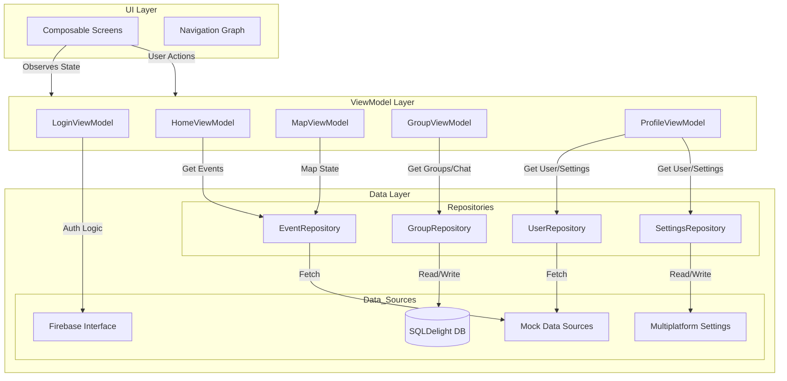

# MunichPulse Architecture Documentation

This document provides a comprehensive overview of the architecture of the **MunichPulse** application. The project is built using **Kotlin Multiplatform (KMP)** and follows the **MVVM (Model-View-ViewModel)** architectural pattern to ensure separation of concerns, testability, and maintainability.

## 1. High-Level Overview

The application is structured into three distinct layers, adhering to the principles of Unidirectional Data Flow (UDF):

1.  **UI Layer (View)**: Renders the user interface and reacts to state changes.
2.  **ViewModel Layer**: Manages UI state, handles user actions, and acts as a mediator between the UI and Data layers.
3.  **Data Layer (Model)**: Manages application data, including fetching from remote sources and persisting to local storage.

### Architecture Diagram

---

## 2. Layer Details

### 2.1 UI Layer (View)
**Location**: `hackatum.munichpulse.ui`

The UI is built using **Jetpack Compose Multiplatform**. It consists of Screens (Composables) that observe state from ViewModels and emit events.

*   **Screens**:
    *   `LoginScreen`: Handles user authentication.
    *   `HomeScreen`: Displays trending and nearby events.
    *   `MapScreen`: Shows events on a map with search and filtering.
    *   `GroupScreen`: Manages group lists and chat functionality.
    *   `ProfileScreen`: Displays user profile, logbook, and settings.
*   **Navigation**: Managed via a central `App` composable and `MainScreen` navigation rail/bar.
*   **Theme**: Custom `UrbanPulseTheme` defined in `ui.theme`, supporting Dark Mode.

### 2.2 ViewModel Layer
**Location**: `hackatum.munichpulse.viewmodel`

ViewModels are responsible for preparing data for the UI and handling user interactions. They expose state using `StateFlow` to ensure the UI is always reactive.

*   **`LoginViewModel`**: Manages login state (`isLoading`, `isLocal`) and authentication logic.
*   **`HomeViewModel`**: Exposes `trendingEvents`, `nearbyEvents`, and `allEvents` by collecting flows from `EventRepository`.
*   **`MapViewModel`**: Manages `MapUiState` (search query, selected filter) and coordinates with the map component.
*   **`GroupViewModel`**: Manages `GroupUiState` (selected group) and exposes the list of groups from `GroupRepository`. Handles sending messages.
*   **`ProfileViewModel`**: Exposes `user` data, `logbookEntries`, and settings (`isDarkMode`, `language`). Bridges UI switches to `SettingsRepository`.

### 2.3 Data Layer (Model)
**Location**: `hackatum.munichpulse.data`

The Data Layer abstracts the sources of data (Network, DB, Cache) from the rest of the app.

#### Repositories
Repositories are the single source of truth for data.

*   **`EventRepository`**: Interface for fetching events. Currently implemented by `MockEventRepository` which provides sample data.
*   **`GroupRepository`**: Singleton object managing groups and chat messages. It uses `SQLDelight` to persist groups, members, and messages locally, enabling offline support.
*   **`UserRepository`**: Interface for user data. Implemented by `MockUserRepository`.
*   **`SettingsRepository`**: Singleton object managing app preferences (Dark Mode, Language) using `MultiplatformSettings`.

#### Data Sources
*   **SQLDelight (`hackatum.munichpulse.data.db`)**:
    *   Used for structured local data (Groups, Messages, Users).
    *   Schema defined in `schema.sq`.
    *   `MunichPulseDatabase` is the entry point.
*   **MultiplatformSettings**:
    *   Used for simple key-value storage (Settings).
*   **Firebase (`hackatum.munichpulse.data.remote`)**:
    *   `FirebaseInterface` provides a wrapper for Firebase Authentication (planned for future expansion).
*   **Mock Data**:
    *   Used for Events and initial User data to facilitate rapid development and testing.

#### Models
**Location**: `hackatum.munichpulse.data.model`
Simple data classes representing the domain entities: `Event`, `User`, `Group`, `LogbookEntry`, `ChatMessage`.

---

## 3. Key Data Flows

### 3.1 Login Flow
1.  User clicks "Login" in `LoginScreen`.
2.  `LoginScreen` calls `LoginViewModel.login()`.
3.  `LoginViewModel` updates state to `isLoading = true`.
4.  (Simulated) Network request completes.
5.  `LoginViewModel` updates state to `isLoading = false` and triggers `onLoginSuccess`.
6.  `App` composable switches to `MainScreen`.

### 3.2 Chat Flow
1.  `GroupScreen` observes `GroupViewModel.groups`.
2.  `GroupViewModel` collects `GroupRepository.groups`.
3.  `GroupRepository` queries `LocalGroup` and `LocalMessage` tables from `MunichPulseDatabase`.
4.  User sends a message in `GroupScreen`.
5.  `GroupViewModel.sendMessage()` is called.
6.  `GroupViewModel` delegates to `GroupRepository.sendMessage()`.
7.  `GroupRepository` inserts the message into `LocalMessage` table via SQLDelight.
8.  The `groups` flow emits the updated list with the new message, updating the UI automatically.

---

## 4. Design Decisions

*   **MVVM**: Chosen for its strong separation of concerns and excellent support in Jetpack Compose via `ViewModel` and `collectAsState`.
*   **Repository Pattern**: Decouples the ViewModel from specific data sources, allowing for easy swapping of implementations (e.g., Mock vs. Real).
*   **SQLDelight**: Selected for type-safe database access and multiplatform support.
*   **KDoc**: All public classes and functions are documented to ensure code readability and maintainability.

